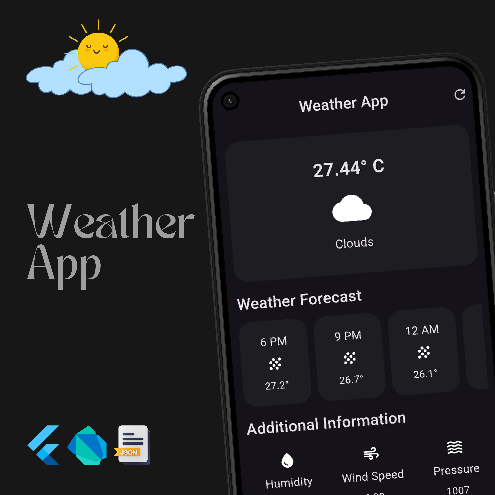

# Weather App

A Flutter-based weather application that provides real-time weather information for any location.



## Features

- Display current weather conditions
- Weather forecast
- Beautiful UI

## Installation

To get started with the project, follow these steps:

1. **Clone the repository:**
    ```bash
    git clone https://github.com/DevNadimm/Weather-App.git
    cd Weather-App
    ```

2. **Install dependencies:**
    ```bash
    flutter pub get
    ```

3. **Run the app:**
    ```bash
    flutter run
    ```

## Usage

1. Open the app on your device.
2. View the current weather conditions and the forecast.

## Technologies Used

- Flutter
- Dart
- OpenWeatherMap API (or any other weather API you used)

## Contributing

If you would like to contribute to this project, please fork the repository and submit a pull request.

1. **Fork the project**
2. **Create your feature branch:**
    ```bash
    git checkout -b feature/YourFeature
    ```
3. **Commit your changes:**
    ```bash
    git commit -m 'Add some feature'
    ```
4. **Push to the branch:**
    ```bash
    git push origin feature/YourFeature
    ```
5. **Open a pull request**

## Contact

If you have any questions, feel free to contact me at [nadimchowdhury87@gmail.com](mailto:nadimchowdhury87@gmail.com).

## Acknowledgments

- Inspiration
- References
